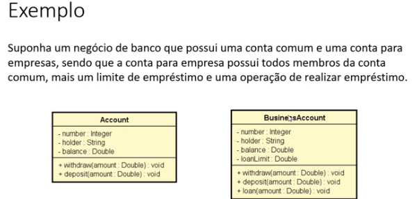
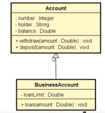

# Herança

### Pontos importantes
- Herdar atributos e métodos (dados e comportamento)
- Reuso
- Polimorfismo

*Sintaxe*
```csharp
:
base
```

### Exemplo com conceitos importantes





A conta para empresa irá herdar os atributos e métodos da conta.

- Relação “é-um(é algo)”: a conta para empresas ela **é** uma conta.
- Generalização/ Especialização: A classe conta é uma conta genérica, e a classe conta para empresas é uma especialização.
- Superclasse (classe base) = Classe genérica
- Subclasse (classe derivada) = Classe especializada
- Herança / extensão = Conta de empresas estende a classe conta. (Tem tudo o que a classe comum tem mais algumas coisas)
- Herança tem a ver com a relação entre classes e não os objetos.