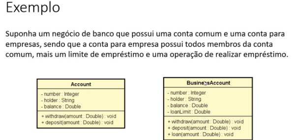
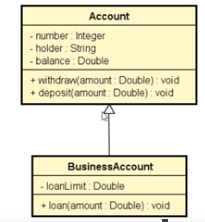
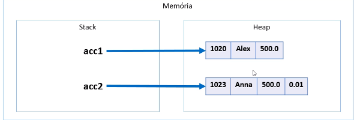

# Herança

### Pontos importantes
- Herdar atributos e métodos (dados e comportamento)
- Reuso
- Polimorfismo

*Sintaxe*
```csharp
:
base
```

### Exemplo com conceitos importantes





A conta para empresa irá herdar os atributos e métodos da conta.

- Relação “é-um(é algo)”: a conta para empresas ela **é** uma conta.
- Generalização/ Especialização: A classe conta é uma conta genérica, e a classe conta para empresas é uma especialização.
- Superclasse (classe base) = Classe genérica
- Subclasse (classe derivada) = Classe especializada
- Herança / extensão = Conta de empresas estende a classe conta. (Tem tudo o que a classe comum tem mais algumas coisas)
- Herança tem a ver com a relação entre classes e não os objetos.

# Polimorfismo

Polimorfismo é a utilização de um mesmo método em contextos diferentes, onde cada objeto criado pode usar esse método, mas com uma implementação específica, atendendo a um objetivo particular.

Um exemplo é:

```csharp
class Animal
{
    public void FazerBarulho()
    {
        Console.WriteLine("O animal faz um som.");
    }
}

class Cachorro : Animal
{
    public void FazerBarulho()
    {
        Console.WriteLine("O cachorro late.");
    }
}

class Gato : Animal
{
    public void FazerBarulho()
    {
        Console.WriteLine("O gato mia.");
    }
}
```

### Outro exemplo é:

```csharp
Account acc1 = new Account(1001, "Alex", 500.0);
Account acc2 = new SavingsAccount(1002, "Anna", 500.0, 0.01);
```



Ambos os objetos são do mesmo tipo (Account) porém os objetos possuem características diferentes.
