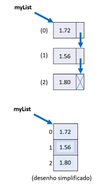

# List

Lista é uma estrutura de dados:

- Homogênea(dados do mesmo tipo)
- Ordenada (elementos acessados por meio de posições)
- inicia vazia, e você adiciona os elementos gradualmente.
- Cada elemento ocupa um “nó” (ou nodo) da lista

- Classe: List
- Namespace: System.Collection.Generic

### Vantagens: 

- Tamanho variável
- Facilidade para se realizar inserções e deleções

### Desvantagens

- Acesso sequencial aos elementos 

<br/> 



> **Um nodo é como um ponto de conexão em uma árvore. Ele contém um valor (ou dados) e zero ou mais conexões para outros nodos. Os nodos são usados para estruturar dados de forma hierárquica, onde um nodo pai pode ter nodos filhos.**

### Comandos

```xml
add("Alex") = Adiciona itens a lista

insert(2,"Marco") = insere intens onde eu quiser 

Cont = Mostra o tamanho da lista

Find(x => x[0] == 'A') = é usado para encontrar um primeiro elemento. 
Usamos uma expressão lambda para encontrar. 

FindLast(x => x[0] == 'A') = A função FindLast procura o ultimo 
elemento da lista que satisfaça a lógica do predicado.

FindIndex(x => x[0] == 'A'); = A função FindIndex procura a posição do primeiro elemento da lista que satisfaça a lógica do predicado.

FindLastIndex(x => x[0] == 'A'); = A função FindLastIndex procura a posição 
do ultimo elemento da lista que satisfaça a lógica do predicado.

FindAll(x => x.Length == 5); O FindAll filtra aquilo que satisfaça o predicado, colocando o resultado em uma nova lista

Remove("Alex");Remove = Remove o elemento que eu selecionar.

RemoveAll(x => x[0] == 'M'); = remove todos que comecem com a letra M.

RemoveAt(3); = Remove o elemento nessa posição.

list.RemoveRange(2, 2); = Remove primeiro a posição e depois o elemento(Posição dois e dois elementos).
```

### Obs:

Predicados Lambda é como uma mini-função que você pode criar rapidamente sem ter que escrever todo o código de uma função completa.

**O que é uma expressão lambda**: É como uma seta **`=>`** que define o que fazer com algum dado. Por exemplo, você pode usar uma expressão lambda para dizer "some 2 a este número" em código como **```(x) => x + 2```**.