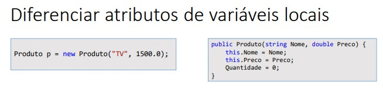
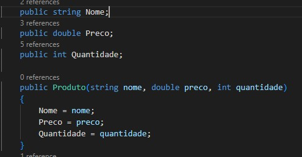
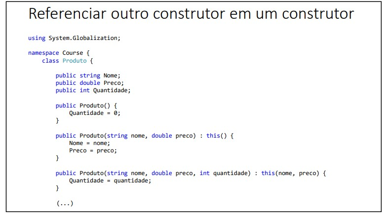
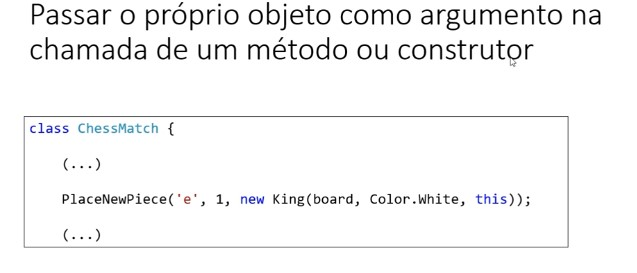

# Palavra this 📚

É uma referência para o próprio objeto

Usos comuns:

```xml
• Diferenciar atributos de variáveis locais (Java)
• Referenciar outro construtor em um construtor
• Passar o próprio objeto como argumento na chamada de um método ou construtor
```

# Uso 01



Nesse exemplo, definimos que os campos receberam os atributos.



No caso em C# está minúsculo, porém é possível ver onde é usado. (Não é muito utilizado em C#, porém em Java é possível ver)

---

# Uso 02



Aqui definimos o construtor padrão e depois podemos reaproveitar em outro construtor.

# Uso 03



Nesse caso estamos dentro de um método, chamando a própria partida de xadrez como argumento.